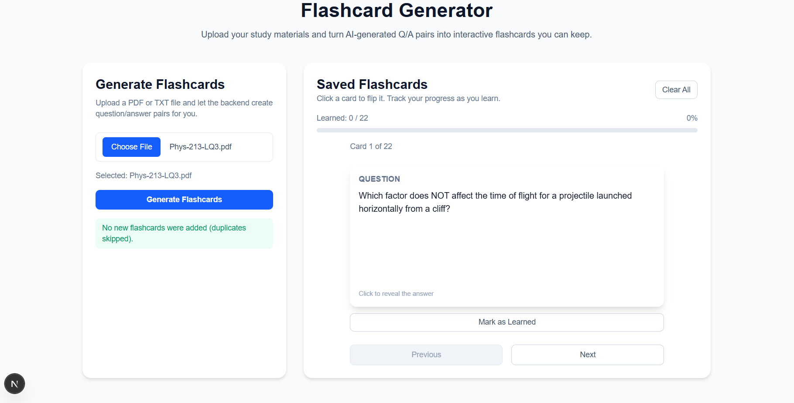
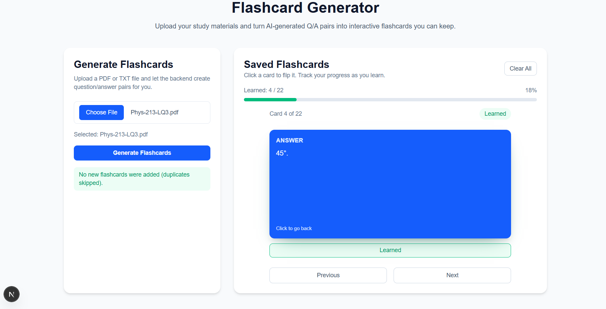

# FLASHCARD GENERATOR APP

A full-stack AI-powered flashcard generator that transforms uploaded notes into interactive study materials.

The FastAPI backend handles PDF and text file uploads, extracts and summarizes content using the Gemini API, and returns concise question-and-answer pairs as structured flashcards.

The Next.js frontend consumes this data to deliver a polished, responsive interface where users can review, flip, and track their progress through dynamically generated study cards.

Flashcards are parsed, stored locally in the browser, and presented in a clean, intuitive workflow — making studying efficient, engaging, and powered by generative AI.
## SCREENSHOTS



## Overview
- Upload lecture notes or study guides in PDF/TXT format.
- Forward the file to the FastAPI backend (`/summarize`) which asks Gemini to produce Q/A pairs.
- Parse the AI response into structured `{ question, answer }` flashcards while removing duplicates.
- Persist the resulting deck locally so learners can return and continue where they left off.
- Review cards one by one with a 3D flip animation, mark items as learned, and track progress across sessions.

## Key Features
- **Document ingestion**: File picker and multipart upload to the backend service with helpful error states.
- **AI output parsing**: Robust Q/A extraction that supports numbered lists and multi-line answers.
- **Duplicate prevention**: Case-insensitive dedupe logic to keep decks clean when regenerating material.
- **Local persistence**: `localStorage` sync on load/update so flashcards survive refreshes and restarts.
- **Interactive flashcards**: Flip animation, keyboard accessibility, and learned badge per card.
- **Single-card focus**: Previous/next navigation with progress bar to keep learners on track.
- **Progress controls**: Learned counter, percentage bar, and �Clear All� to reset the deck.

## Core Functions & Components
- `parseFlashcards(raw: string)` - converts Gemini text into structured flashcards.
- `mergeFlashcards(existing, incoming)` - merges new cards with dedupe handling and learned-state preservation.
- `FlashcardItem` component - renders the front/back faces, flip animation, and learned toggle button.
- `Home` page - orchestrates upload, state management, persistence, and the review experience.

## Tech Stack
### Front End
- Next.js (App Router) + React + TypeScript
- Tailwind CSS + custom 3D transform styling
- Axios for HTTP requests
- localStorage for client persistence

### Backend (companion service)
- FastAPI (Python)
- Gemini API client (via Google Generative AI SDK)
- PyPDF / text processing utilities for document ingestion

## Getting Started
```bash
# Install dependencies
npm install

# Run the development server
npm run dev

# Lint the project
npm run lint
```
Open http://localhost:3000 to view the UI. The app expects the FastAPI backend to be available at http://127.0.0.1:8000.

> Tip: If the backend URL differs, update the Axios endpoint in `src/app/page.tsx` (look for the `axios.post("http://127.0.0.1:8000/summarize", ...)` call).

## Directory Highlights
- `src/app/page.tsx` - main UI page, flashcard logic, and upload flow.
- `src/app/globals.css` - Tailwind base styles and custom flashcard animation classes.
- `public/` - static assets.

## Future Enhancements
- Deck export/import for sharing between devices.
- Keyboard shortcuts for flip/next/previous navigation.
- Filter views (e.g., learned vs. to review) and spaced repetition scheduling.

## License
Copyright (c) 2025 Daven Austhine Sumagang

Permission is hereby granted, free of charge, to any person obtaining a copy
of this software and associated documentation files (the "Software"), to deal
in the Software without restriction, including without limitation the rights
to use, copy, modify, merge, publish, distribute, sublicense, and/or sell
copies of the Software, and to permit persons to whom the Software is
furnished to do so, subject to the following conditions:

The above copyright notice and this permission notice shall be included in all
copies or substantial portions of the Software.

